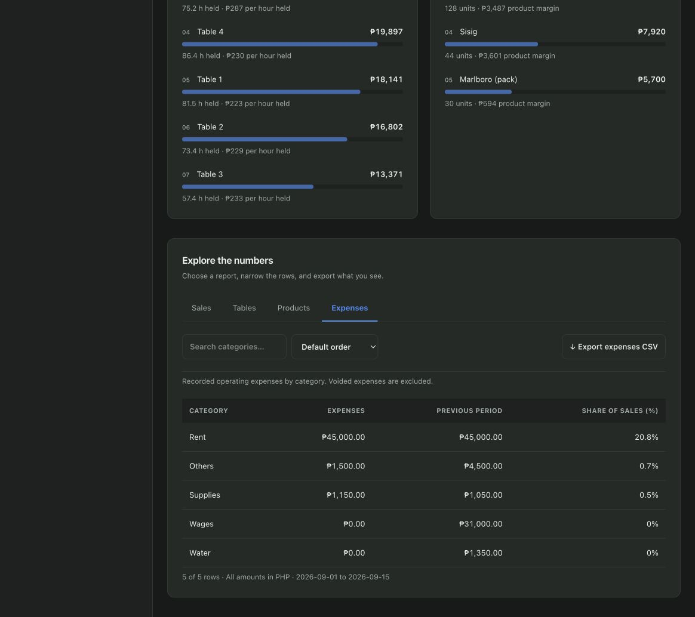

# Tabbed Reports recovery

## Provenance

IntelliJ Local History was inspected first at `IdeaIC2024.1/LocalHistory`. Its binary change store contains entries for all four requested filenames, but no source was extracted from it. No files are represented as a Local History recovery.

The four files were recovered from the intact local `scratchpad/vps/frontend` build snapshot of the discarded attempt:

- `src/features/admin/reports/ReportExplorer.tsx`
- `src/features/admin/reports/reportData.ts`
- `src/features/admin/reports/ReportsPage.tsx`
- `tests/reportData.test.mjs`

No whole file was reconstructed from conversation context. The package script was restored from context. The existing giveaway group headings were retained when restoring ReportsPage, and the sales receipt-link explanation was reapplied from context. New minimum-to-ship edits qualify break-even as a selected-period estimate and fix print styling.

## Recovered content

- Sales: date, bills, sales, product cost, expenses, after recorded costs; daily/weekly/monthly grouping and settled-receipt links.
- Tables: hours held, utilization, time sales, and sales per hour held; lowest-return note.
- Products: quantity, sales, cost, margin, margin percentage; nonpositive-margin warning.
- Expenses: category, recorded expenses, previous-period amount, and share of sales.
- Search, sort, and filtered CSV exports. Whole-period daily Sales CSV remains available.
- Six-month expense history and unsold stock stay separate. Duplicate full detail tables are screen-hidden and print-visible.

## Validation

- Typecheck and production build pass; existing bundle-size advisory remains.
- Three report tests pass, including real API reconciliation of daily/weekly/monthly totals.
- Both unchanged morning tests pass.
- Backend suite: 203 passed, zero failures/errors/skips, against a fresh scratch database removed afterward.
- Browser: all four tabs opened and their columns verified; Expenses search for rent returns the rent row.
- Print action exercised. DOM/CSS inspection confirms four complete print-only detail sections, expanded disclosure bodies and headings, and a hidden interactive explorer. Fixed globally hidden report panel headers and dark-theme text/background tokens for print.
- The embedded browser does not expose native print preview/PDF output. Actual paper pagination remains a manual review item; it is not claimed as verified.

