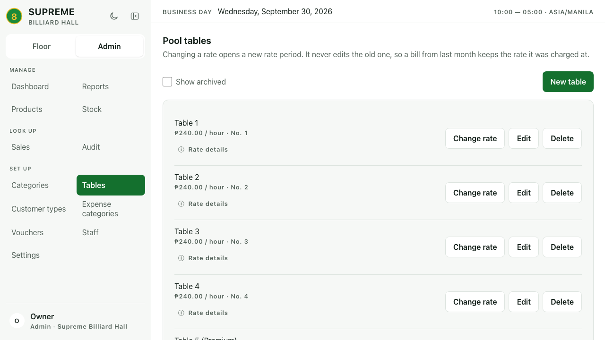
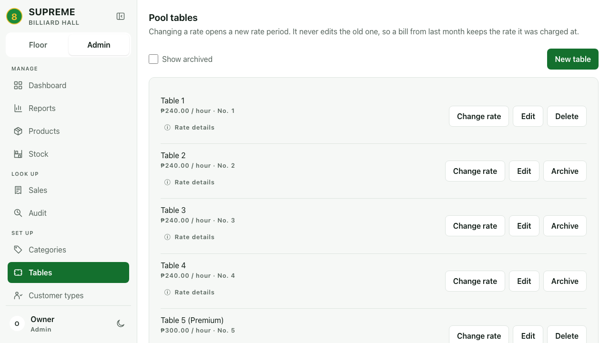
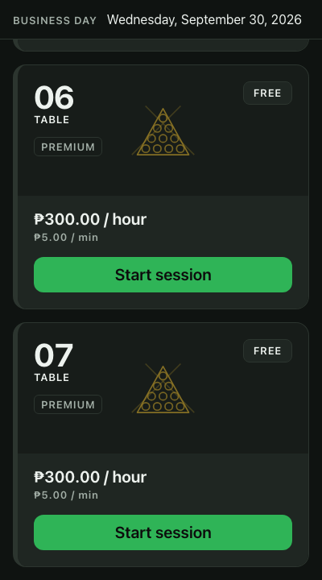

# QA Part 2 PR-02: sidebar and business-day header

Implements PR-02 only from the owner's `QA-PART2-PR-PLAN.md`. Visually reviewed
`qapart2.pdf` pages 1–4, 8–9, 12, 15, 17–18 and 20. Decision 5 defines the
Floor-only exception to the repeated date-strip removal notes.

Dependency PR-01 is merged as [#11](https://github.com/wilsonTiquia/supreme-billiards-hall/pull/11),
commit `6e4c1e061bdb028454073012613662ecd5cea8ff` (2026-09-30 18:48:54 UTC).
This branch started from that latest `origin/main` in a separate worktree. The
original checkout's untracked plan and `TestDTO.java` were left untouched.

## Changes

- One column of destinations with shared SVG icons; expanded labels and a compact
  icon rail with accessible names and hover/focus hints. No abbreviated route names.
- The destination list scrolls independently. The workspace switch and bottom
  account/theme controls remain usable at 540px height with targets at least 44px.
- The account retains the name and role without repeating the branch name.
- The global date strip appears only on `/floor` (including `/floor/`), sticks to
  the viewport top with an opaque background, and stays below drawers/dialogs.
  Floor controls have scroll clearance for keyboard focus.
- Mobile navigation closes even when selecting the current destination. Focus
  trapping, Escape/backdrop dismissal, and focus restoration are retained.
- Business-date queries, page date controls, role guards, and API contracts are
  unchanged. No backend, schema, accounting, or stock changes.

## Validation

- `cd frontend && npm run typecheck` — passed.
- `cd frontend && npm run build` — passed (206 modules); existing bundle-size
  advisory remains (547.78 kB main JavaScript bundle).
- `DB_URL=jdbc:postgresql://localhost:5432/supreme_pr02_20261001_scratch DB_USERNAME=supreme DB_PASSWORD=supreme ./mvnw -B resources:copy-resources@copy-frontend test`
  — **245 tests, 0 failures, 0 errors, 0 skipped**. A dedicated PostgreSQL 18
  database was created for this run. The first attempt preceded the frontend
  build and failed one missing-`static/index.html` check; the built-SPA rerun passed.
- `cd frontend && PR02_CAPTURE=after E2E_DB_NAME=supreme_pr02_e2e npm run e2e -- pr02-shell.spec.ts pr02-screenshots.spec.ts floor-qa.spec.ts employee-sees-no-cost.spec.ts`
  — **15 passed (1.5m)**: ten shell regressions, one screenshot capture, three
  existing Floor regressions, and the existing employee-cost visibility check.
  This final run includes the current-route drawer and scrolled-focus hint fixes.
- Before capture: `cd frontend && PR02_CAPTURE=before E2E_DB_NAME=supreme_pr02_e2e npm run e2e -- pr02-screenshots.spec.ts`
  — **1 passed**, against unchanged `6e4c1e0` application code.
- Mutation check: temporarily removed header stickiness and ran
  `E2E_DB_NAME=supreme_pr02_e2e npm run e2e -- pr02-shell.spec.ts -g '1280px light'`.
  It failed as intended: the scrolled header was at **y = -296**, expected **0**.
  Restored stickiness before final validation.

The shell regression coverage exercises every owner destination in expanded and
compact navigation, mobile and short desktop layouts, employee route restrictions,
account/theme persistence, keyboard trapping and dismissal, Floor-only header
visibility, sticky stacking and keyboard clearance in both themes, empty/loading/error
states, a long account name, and a read-only 40-table fixture. Existing Floor checks
cover session, checkout, receipt, payment-photo retry and duplicate-reference behavior.
The photo-retry assertion now selects its payment status specifically so an unrelated
notes-loading status cannot cause a strict-locator race.

The full Playwright suite and `test:reports` were not run; report components/data
were not changed. All browser writes use the guarded scratch backend on 8081 and
Vite on 5174, never the trading database or deployed service.

## Screenshots

All images use scratch data. Desktop: 1280×720. Mobile: 400×800. Before images
were captured on main before editing; after images use the same seeded table
catalog. The table below links every before/after variant. Sticky images show the
Floor after scrolling. Existing Floor QA images generated by the regression suite
are not included in this PR.

| Screen | Light before / after | Dark before / after |
| --- | --- | --- |
| Admin expanded | [before](before-admin-light-1280.png) / [after](after-admin-light-1280.png) | [before](before-admin-dark-1280.png) / [after](after-admin-dark-1280.png) |
| Admin compact | [before](before-admin-collapsed-light-1280.png) / [after](after-admin-collapsed-light-1280.png) | [before](before-admin-collapsed-dark-1280.png) / [after](after-admin-collapsed-dark-1280.png) |
| Floor expanded | [before](before-floor-light-1280.png) / [after](after-floor-light-1280.png) | [before](before-floor-dark-1280.png) / [after](after-floor-dark-1280.png) |
| Floor compact | [before](before-floor-collapsed-light-1280.png) / [after](after-floor-collapsed-light-1280.png) | [before](before-floor-collapsed-dark-1280.png) / [after](after-floor-collapsed-dark-1280.png) |
| Admin mobile | [before](before-admin-light-400.png) / [after](after-admin-light-400.png) | [before](before-admin-dark-400.png) / [after](after-admin-dark-400.png) |
| Admin drawer | [before](before-admin-drawer-light-400.png) / [after](after-admin-drawer-light-400.png) | [before](before-admin-drawer-dark-400.png) / [after](after-admin-drawer-dark-400.png) |
| Floor mobile | [before](before-floor-light-400.png) / [after](after-floor-light-400.png) | [before](before-floor-dark-400.png) / [after](after-floor-dark-400.png) |
| Floor drawer | [before](before-floor-drawer-light-400.png) / [after](after-floor-drawer-light-400.png) | [before](before-floor-drawer-dark-400.png) / [after](after-floor-drawer-dark-400.png) |

| Scrolled Floor | Light | Dark |
| --- | --- | --- |
| 1280px | [Light](after-floor-sticky-light-1280.png) | [Dark](after-floor-sticky-dark-1280.png) |
| 400px | [Light](after-floor-sticky-light-400.png) | [Dark](after-floor-sticky-dark-400.png) |

### Admin sidebar

| Before | After |
| --- | --- |
|  |  |

### Mobile Floor after scrolling

