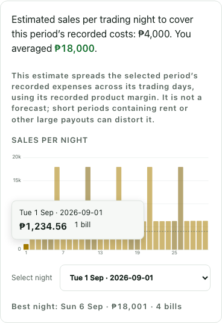
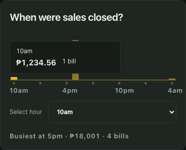
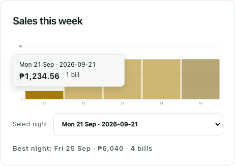
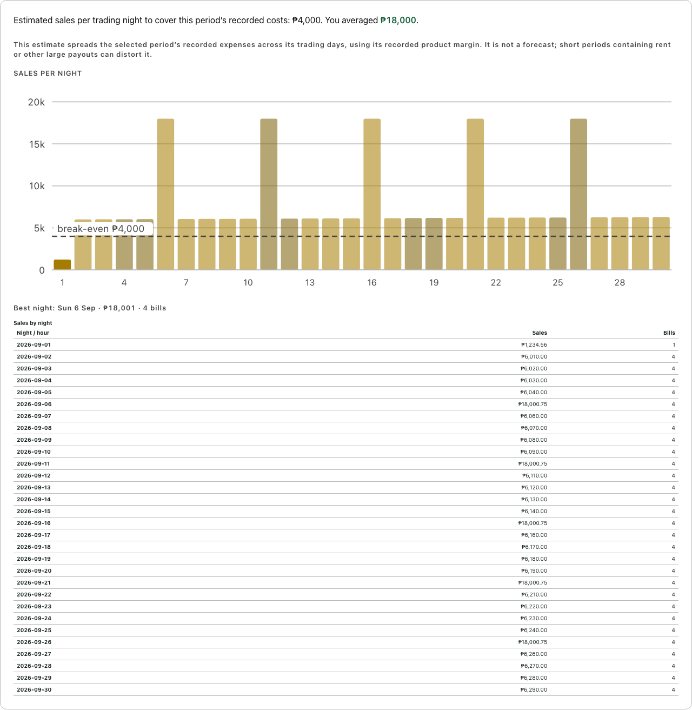

# QA Part 2 — PR-03 evidence

Scope: analytics tooltips, dashboard sales-source donut, shared table tiles, top-five product summaries, and the owner-approved premium classification migration/API/admin control. Reference: `qapart2.pdf`, pages 6–10, and the local QA-PART2-PR-PLAN.md shared instructions / PR-03 brief.

Base: `8056d01225ca18ac8ca972cb7fcd8bb6a16195d9` (latest `origin/main`, checked again before submission). Required PR-01 landed in #11 at `6e4c1e0`; `git merge-base --is-ancestor` confirmed it is in the base. PR-02 (#12) is also present. Work was isolated on `codex/qa-part2-pr03`; the original checkout's untracked plan and TestDTO.java were preserved.

## Confirmed premium classification

Owner decision, 2 October 2026: add explicit editable metadata in this PR. Tables 1, 2 and 3 are Premium; all other existing tables and new tables default to Standard. V23 targets the verified UUIDs and MAIN branch only. The local `supreme` records were inspected with a read-only PostgreSQL session before authoring the migration; see [verification details](premium-verification.md). No live database writes or deployment were performed.

Table administration now edits `isPremium`; omission on create defaults to false, while omission/null on edit preserves the existing flag for older clients. Daily/period report rows return stable table IDs and the current flag. Stars and the legend use only that metadata. Classification changes are audited and leave current rates, rate periods, active session rates, historical amounts and receipt snapshots unchanged.

## Implementation

- Night/hour bars show exact peso amounts (including centavos), date/hour and bill count. Pointer hover, keyboard focus with arrow/Home/End navigation, and touch selection work. Escape dismisses the tooltip. Captions remain unchanged during selection.
- A 44px native selector provides a touch and keyboard alternative to narrow bars, including 366-date periods. Tooltip placement stays inside the chart's horizontal bounds. The report break-even label is hidden only when its rendered rectangle overlaps the tooltip; the line remains and the label is restored afterward and in print.
- The SVG donut encodes only positive table/product source amounts. The existing discount/voucher reconciliation stays in the separate numeric ledger; empty and single-source donuts are explicit.
- Table tiles preserve dashboard held time/utilisation and report revenue/occupied-hour context. Two-line product entries preserve ordering and the five-item limit. Detailed report margin figures remain in the existing report detail views.
- Print-only tables expose every night/hour amount and bill count without requiring hover. Print media was exercised in Chromium; no physical printer was used.

## Actual validation

Final browser validation used `E2E_DB_NAME=supreme_pr03_premium_e2e E2E_API_PORT=8083 E2E_WEB_PORT=5176`. The repository's Playwright guards and scratch-backend script remained enabled. Visual report fixtures intercept read-only responses from this scratch app; they are synthetic display scenarios, not production data or accounting reconciliation fixtures. Administration tests use real scratch API writes and read-back.

- `npm --prefix frontend run typecheck` — passed.
- `npm --prefix frontend run build` — passed. Existing Vite chunk-size advisory remains. Installed npm also warns that local Node 20.13.1 is below its supported patch range; commands completed successfully.
- `npm --prefix frontend run test:reports` — **5 passed, 0 failed, 1 skipped**. The optional real-response CSV reconciliation test was not configured (`REAL_REPORT_JSON` unset).
- `DB_URL=jdbc:postgresql://localhost:5432/supreme_pr03_premium_scratch DB_USERNAME=supreme DB_PASSWORD=supreme ./mvnw -B resources:copy-resources@copy-frontend test` — **250 tests, 0 failures, 0 errors, 0 skipped**. Database was separately created for this run.
- `PR03_PREMIUM_CAPTURE=after PR03_CAPTURE=after E2E_DB_NAME=supreme_pr03_premium_e2e E2E_API_PORT=8083 E2E_WEB_PORT=5176 npm --prefix frontend run e2e -- pr03-analytics.spec.ts pr03-premium.spec.ts pr03-premium-screenshots.spec.ts pr03-screenshots.spec.ts pr01-pagination.spec.ts worked-trace.spec.ts` — **15 passed, 0 failed**. Includes existing report/filter/export/pagination behavior and the real scratch checkout worked trace at ₱630.00.
- Before captures: the original analytics capture against unmodified main passed (1 test); the table-administration capture against the previous committed UI passed (1 test). Both used the guarded scratch harness.
- Tooltip mutation check: temporarily rounded pesos; the night-tooltip test failed at the expected `₱1,234.56` assertion. Restored exact formatting before final checks.
- Premium mutation check: temporarily discarded explicit flag updates; both rate-mode cases of `PoolTablePremiumTest#classificationPersistsAuditsAndNeverRepricesAnEdit` failed at persisted read-back, expected true but received false. Restored flag updates before the final 250-test green run.
- `git diff --check` — passed. Task-owned scratch databases were removed after validation.

Backend coverage executes V23 and verifies exact backfill IDs, Standard defaults, unchanged rate rows and other table fields, flag persistence after flush/clear, audit before/after values, omitted-flag compatibility, branch/role access, unchanged active-session segments, and unchanged historical report figures and receipt. A real three-hour session at the existing ₱200/hour configuration retains its rounded per-minute billing result of ₱599.99.

Browser coverage includes real admin edits in both rate modes, new-table Standard defaults, metadata-driven stars despite misleading names/rates, legend presence/absence, stable captions, mouse/keyboard/touch/Escape, break-even overlap, exact centavos, zero/single-source sales, discounts, zero-valued hours, long names, top-five ordering, 366 dates, loading/error states, and printable night/hour figures.

The full unrelated Playwright suite and physical printing were not run. No merge or deployment was performed.

## Visual review and existing limitation

Before and after screenshots cover Dashboard and Reports in light/dark themes at 1280px and 400px viewport widths. The existing Reports page has document-level horizontal overflow: its 400px-viewport full-page captures are 750px wide both before and after. PR-03's changed chart/tooltip/summary regions fit the viewport. This pre-existing Reports layout issue was not expanded into this PR; focused chart screenshots below show the actual mobile width.

| Screen | Width / theme | Before | After |
|---|---|---|---|
| Dashboard | 1280 light | [Before](before-dashboard-light-1280.png) | [After](after-dashboard-light-1280.png) |
| Dashboard | 1280 dark | [Before](before-dashboard-dark-1280.png) | [After](after-dashboard-dark-1280.png) |
| Dashboard | 400 light | [Before](before-dashboard-light-400.png) | [After](after-dashboard-light-400.png) |
| Dashboard | 400 dark | [Before](before-dashboard-dark-400.png) | [After](after-dashboard-dark-400.png) |
| Reports | 1280 light | [Before](before-reports-light-1280.png) | [After](after-reports-light-1280.png) |
| Reports | 1280 dark | [Before](before-reports-dark-1280.png) | [After](after-reports-dark-1280.png) |
| Reports | 400 light | [Before](before-reports-light-400.png) | [After](after-reports-light-400.png) |
| Reports | 400 dark | [Before](before-reports-dark-400.png) | [After](after-reports-dark-400.png) |

### Focused interactions and print

Additional tooltip captures for both screens, both themes and both widths are in this directory.

## Premium administration screenshots

| View | Before | After |
|---|---|---|
| Tables, desktop light | [Before](before-tables-light-1280.png) | [After](after-tables-light-1280.png) |
| Tables, mobile dark | [Before](before-tables-dark-400.png) | [After](after-tables-dark-400.png) |
| Edit, desktop light | [Before](before-table-edit-light-1280.png) | [After](after-table-edit-light-1280.png) |
| Edit, mobile dark | [Before](before-table-edit-dark-400.png) | [After](after-table-edit-dark-400.png) |

Both widths and themes are captured for the table list and edit form. Before captures use the previous committed table administration UI; after captures use the new control. Updated Dashboard/Reports captures above include metadata-driven stars and the legend.
