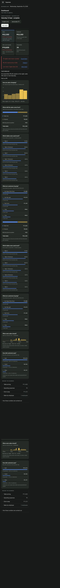
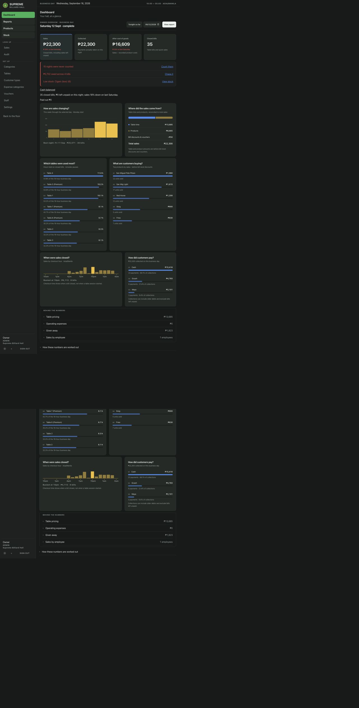
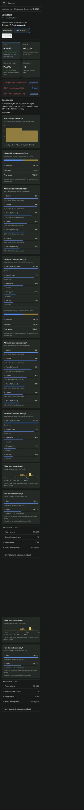
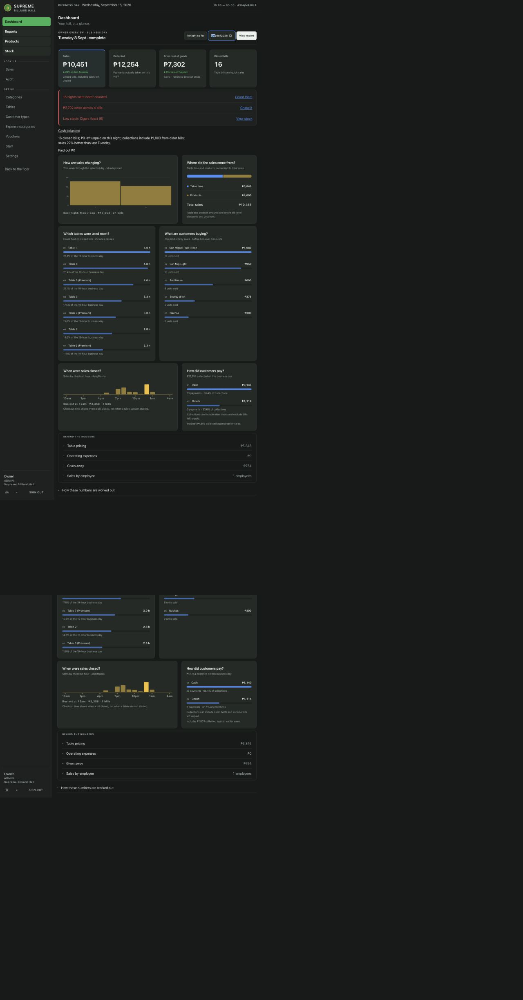
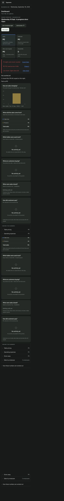
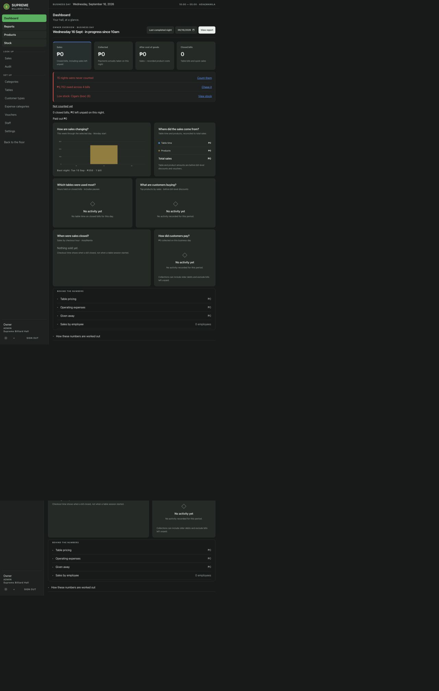

# Restored analytics dashboard

Recovered the pre-f292167 dashboard and analytics styling from a local build snapshot. Retained the current completed-night/date/cash logic; `morning.ts` and `tests/morning.test.mjs` are unchanged.

The headline order is Sales, Collected, After cost of goods, Closed bills. Attention immediately follows the figures, then the always-present cash line, summary, and stated payouts. The recovered chart panels follow these controls. There is no per-night after-operating-costs figure.

## Screenshots

Real local demo data, captured at the specified CSS widths, full page:

| State | 400px | 1280px |
| --- | --- | --- |
| Saturday 12 September 2026; signed off, cash balanced |  |  |
| Tuesday 8 September 2026; signed off, cash balanced |  |  |
| Wednesday 16 September 2026; in progress, not counted |  |  |

Tuesday's collections include payments for earlier bills, so Collected exceeds Sales; the summary explains the difference. Tonight has no sales yet and no comparison lines. No test sales or cash counts were created.

## Verification

- `npm run build`: passed (existing bundle-size advisory).
- `node --test tests/morning.test.mjs`: both unchanged tests passed.
- Browser: Sales/Collected adjacent at both widths; attention directly after figures; cash line present; no running-night comparison lines.
- Reports round-trip preserves the selected date in the URL.
- No changes to report pages, financial SQL, morning helpers, or their tests.
